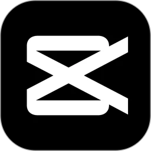
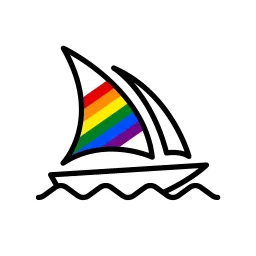
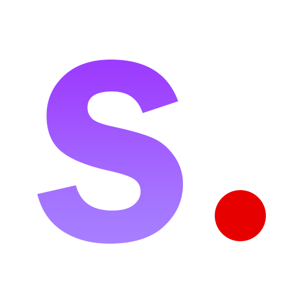
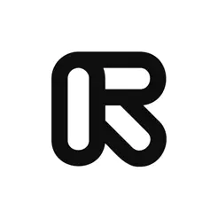
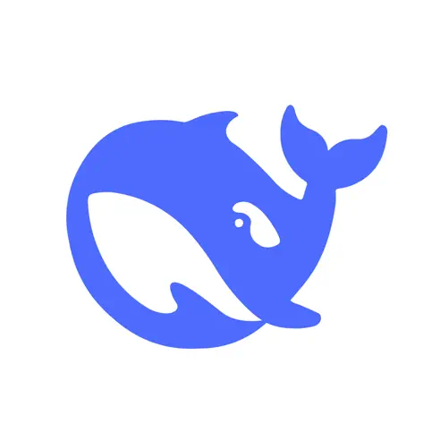
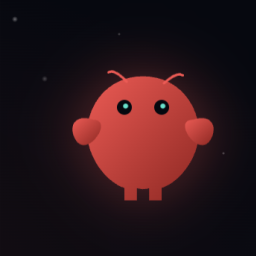
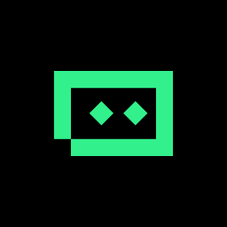

<section class="relative pt-10 pb-16 overflow-hidden hero-gradient">

<h1 class="text-5xl md:text-6xl font-bold leading-tight mb-6">
x-AI，让AI成为你的智能生产力
</h1>

探索 AI 工具、赛道与案例，引领智能未来。我们提供最前沿的AI技术和应用，帮助你抓住AI时代的机遇。

<a class="px-8 py-4 bg-white text-slate-600 rounded-2xl font-bold border border-slate-200 flex items-center gap-2 hover:bg-slate-50 transition-colors no-underline" href="#video-image">
立即学习
</a>
<a class="px-8 py-4 bg-blue-600 text-white rounded-2xl font-bold shadow-2xl shadow-blue-200 flex items-center gap-2 hover:scale-105 transition-transform no-underline explore-btn" href="#business">
火速变现 
</a>

10,000+ 用户已学习

<h3 class="text-white font-bold">AI 工具仪表盘</h3>

精选推荐

10大高效工具

快速变现

3大赚钱方向

</section>

<section id="video-image" class="py-6 max-w-7xl mx-auto px-6">

<h2 class="text-xl font-bold text-slate-900">视频图像</h2>

<a href="https://ai-bot.cn/app/10296.html" target="_blank" class="tool-card card-hover no-underline">

<h3 class="font-bold text-lg mb-1 text-slate-900">剪映AI教程</h3>

字节旗下，AI视频剪辑首选，智能字幕、特效、配音

免费
新手友好

</a>

<a href="https://jimengai.com/" target="_blank" class="tool-card card-hover no-underline">

<h3 class="font-bold text-lg mb-1 text-slate-900">即梦AI教程</h3>

即梦AI，Seedance2.0，国内顶尖AI绘画/视频生成，画质极佳

精品首选
中高价位

</a>

<a href="https://www.midjourney.com/" target="_blank" class="tool-card card-hover no-underline">

<h3 class="font-bold text-lg mb-1 text-slate-900">Midjourney教程</h3>

业界画质标杆，AI图像生成天花板，专业艺术创作首选

画质顶尖
订阅制

</a>

<a href="https://stability.ai/" target="_blank" class="tool-card card-hover no-underline">

<h3 class="font-bold text-lg mb-1 text-slate-900">SD教程</h3>

StableDiffusion教程，开源AI绘画基座，自由度最高，本地部署

开源免费
技术向

</a>

<a href="https://runwayml.com/" target="_blank" class="tool-card card-hover no-underline">

<h3 class="font-bold text-lg mb-1 text-slate-900">Runway教程</h3>

专业级AI视频工具，Gen-2视频生成，影视级效果，技术向

专业级
高价位

</a>

</section>

<section id="efficiency-tools" class="py-6 max-w-7xl mx-auto px-6">

<h2 class="text-xl font-bold text-slate-900">高效工具</h2>

<a href="#" class="tool-card card-hover no-underline">

<h3 class="font-bold text-lg mb-1 text-slate-900">DeepSeek教程</h3>

DeepSeek官方教程，提示词工程入门到精通

必修课
免费教程

</a>

<a href="https://github.com/OpenClaw" target="_blank" class="tool-card card-hover no-underline">

<h3 class="font-bold text-lg mb-1 text-slate-900">OpenClaw教程</h3>

开源免费的个人AI助手，本地部署，隐私安全

开源免费
本地部署

</a>

<a href="https://www.trae.ai/" target="_blank" class="tool-card card-hover no-underline">

<h3 class="font-bold text-lg mb-1 text-slate-900">Trae教程</h3>

AI原生IDE，智能代码补全与生成，开发效率翻倍

AI IDE
免费使用

</a>

<a href="https://cursor.sh/" target="_blank" class="tool-card card-hover no-underline">

<h3 class="font-bold text-lg mb-1 text-slate-900">Cursor教程</h3>

AI代码编辑器，GPT-4驱动，代码生成与重构神器

编程神器
订阅制

</a>

<a href="https://claude.ai/" target="_blank" class="tool-card card-hover no-underline">

<h3 class="font-bold text-lg mb-1 text-slate-900">ClaudeCode教程</h3>

Anthropic官方编程助手，长上下文，代码理解力强

长上下文
订阅制

</a>

</section>

<section id="business" class="py-6 max-w-7xl mx-auto px-6">

<h2 class="text-xl font-bold text-slate-900">商业落地</h2>

<a href="/x-ai-web/drama-comic.html" class="tool-card card-hover no-underline p-6">

<h3 class="font-bold text-xl text-slate-900">漫剧短剧</h3>

AI生成短剧内容变现

利用AI工具快速生成短剧脚本、分镜、视频内容，在抖音、快手等平台实现内容变现。低成本、高效率的短剧生产流程。

热门赛道
变现快
门槛低

</a>

<a href="/x-ai-web/digital-human.html" class="tool-card card-hover no-underline p-6">

<h3 class="font-bold text-xl text-slate-900">直播带货</h3>

AI数字人直播变现

数字人24小时不间断直播，降低人力成本。AI智能话术、实时互动，提升转化率。适合电商、知识付费等多种场景。

24小时直播
低成本
高转化

</a>

<a href="/x-ai-web/side-business.html" class="tool-card card-hover no-underline p-6">

<h3 class="font-bold text-xl text-slate-900">副业变现</h3>

AI工具副业赚钱指南

利用AI工具接单赚钱：AI绘画接单、文案代写、视频制作、PPT设计等。零成本启动，适合上班族和学生党的副业选择。

零成本
时间自由
多平台

</a>

</section>
